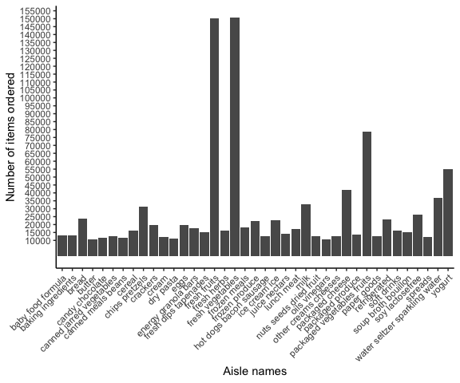
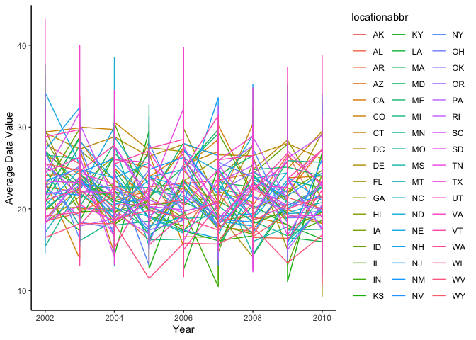
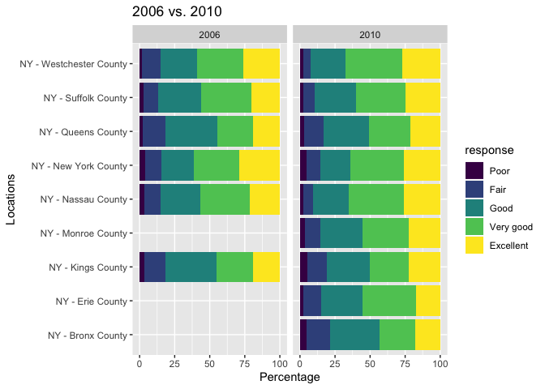
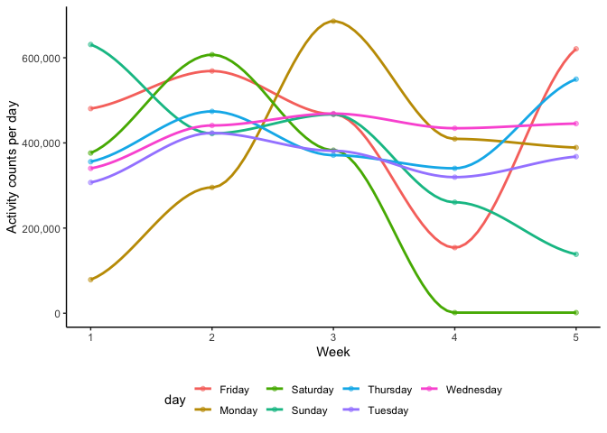

p8105\_hw3\_zc2443
================
Ziyang Chen
10-07-2019

## Problem 1

``` r
library(p8105.datasets)
data("instacart")

str(instacart) #take a brief view of the dataset
```

The `instacart` dataset contains 15 variables and 1384617 observations.
There are 11 numeric variables and 4 character variables. The dataset
records data of rading information for some commodities. Some of the key
variables are product id, order number, reordered, days since prior
order and aisle\_id. For example, 4 product with id 49302 in aisle with
id 120 is purchased and has ever been repurchased. The last time that
this product got purchased was 9 days ago.

``` r
instacart %>% 
  group_by(aisle) %>% 
  summarize(n_obs = n()) %>% #find the number of ordered items for each aisle
  arrange(desc(n_obs)) 
```

There are 134 aisles. The most items are ordered from fresh vegetables
asile.

``` r
instacart %>% 
  group_by(aisle) %>% 
  summarize(n_obs = n()) %>% 
  filter(n_obs > 10000) %>% #filter to get aisles with 10000+ ordered items
  arrange(aisle) %>% #arrange by aisle names alphabetically
  ggplot(aes(x = aisle, y = n_obs)) + geom_bar(stat = "identity") + #use bar plot
  theme_classic() + #change the theme
  theme(axis.text.x = element_text(angle = 45, hjust = 1)) + #rotate the labels of x-axis to 45 degrees
  scale_y_continuous(breaks = seq(10000,160000,5000)) + #set the break points on y-axis
  labs(x = "Aisle names", y = "Number of items ordered") #name x-axis and y-axis
```

<!-- --> The
number of items ordered for Fresh fruits and fresh vegetables aisles are
way more than other items.

``` r
instacart %>% 
  filter(aisle %in% c("baking ingredients", "dog food care", "packaged vegetables fruits")) %>% 
  group_by(aisle, product_name) %>% 
  summarize(tot_order = sum(order_number)) %>% #sum up the times each item is ordered
  mutate(ord_ranking = min_rank(desc(tot_order))) %>% #assign each number of times each item is ordered a rank under grouping
  filter(ord_ranking %in% c(1,2,3)) %>% #select only the top 3 ranking
  arrange(aisle, ord_ranking) %>% 
  knitr::kable()
```

| aisle                      | product\_name                                 | tot\_order | ord\_ranking |
| :------------------------- | :-------------------------------------------- | ---------: | -----------: |
| baking ingredients         | Light Brown Sugar                             |       8605 |            1 |
| baking ingredients         | Cane Sugar                                    |       6244 |            2 |
| baking ingredients         | Organic Vanilla Extract                       |       6003 |            3 |
| dog food care              | Standard Size Pet Waste bags                  |        675 |            1 |
| dog food care              | Beef Stew Canned Dog Food                     |        631 |            2 |
| dog food care              | Snack Sticks Chicken & Rice Recipe Dog Treats |        589 |            3 |
| packaged vegetables fruits | Organic Baby Spinach                          |     171301 |            1 |
| packaged vegetables fruits | Organic Raspberries                           |     113932 |            2 |
| packaged vegetables fruits | Organic Blueberries                           |      86765 |            3 |

The three most popular items of baking ingredients aisle are light brown
sugar with 8605 times of order, cane sugar with 6244 times of order, and
organic banilla extract with 6003 times of order; those of dog food care
are standard size pet waste bags with 675 times of order, beef stew
canned dog food with 631 times of order, and snack sticks chicken & rice
recipe dog treats with 589 times of order; those of packaged vegetables
fruits are organic baby spinach with 171301 times of order, organic
rasberries with 113932 times of order, and organic blue berries with
86765 times of order.

``` r
instacart %>% 
  filter(product_name %in% c("Pink Lady Apples", "Coffee Ice Cream")) %>% #filter the dataset
  group_by(product_name, order_dow) %>% 
  summarize(mean_order_hour_of_day = mean(order_hour_of_day)) %>% #find the mean of order hour of day under grouping
  pivot_wider(names_from = order_dow, values_from = mean_order_hour_of_day) %>% #untidy the dataset to generate a 2x7 table
  knitr::kable()
```

| product\_name    |        0 |        1 |        2 |        3 |        4 |        5 |        6 |
| :--------------- | -------: | -------: | -------: | -------: | -------: | -------: | -------: |
| Coffee Ice Cream | 13.77419 | 14.31579 | 15.38095 | 15.31818 | 15.21739 | 12.26316 | 13.83333 |
| Pink Lady Apples | 13.44118 | 11.36000 | 11.70213 | 14.25000 | 11.55172 | 12.78431 | 11.93750 |

We can see that the mean order hour of day is highest on Tuseday for
coffee ice cream and on Wednesday for pink lady apples.

## Problem 2

``` r
library(p8105.datasets)
data("brfss_smart2010")

str(brfss_smart2010) #take a brief look at the dataset

brfss_smart2010 = brfss_smart2010 %>% 
  janitor::clean_names() %>% 
  filter(topic == "Overall Health", response %in% c("Excellent", "Very good", "Good", "Fair","Poor")) %>%   mutate(response = fct_relevel(response, "Poor", "Fair", "Good", "Very good","Excellent")) #re-level resoinse
```

``` r
brfss_smart2010 %>% 
  filter(year == 2002) %>% #filter the year to be 2002
  group_by(locationabbr, locationdesc) %>% 
  summarize(n_obs = n()) %>% #count the number of observations under each location
  group_by(locationabbr) %>% 
  summarize(n_obs = n()) %>% #count the number of locations under each state
  filter(n_obs >= 7)
```

    ## # A tibble: 6 x 2
    ##   locationabbr n_obs
    ##   <chr>        <int>
    ## 1 CT               7
    ## 2 FL               7
    ## 3 MA               8
    ## 4 NC               7
    ## 5 NJ               8
    ## 6 PA              10

``` r
brfss_smart2010 %>% 
  filter(year == 2010) %>% 
  group_by(locationabbr, locationdesc) %>% 
  summarize(n_obs = n()) %>% 
  group_by(locationabbr) %>% 
  summarize(n_obs = n()) %>% 
  filter(n_obs >= 7)
```

    ## # A tibble: 14 x 2
    ##    locationabbr n_obs
    ##    <chr>        <int>
    ##  1 CA              12
    ##  2 CO               7
    ##  3 FL              41
    ##  4 MA               9
    ##  5 MD              12
    ##  6 NC              12
    ##  7 NE              10
    ##  8 NJ              19
    ##  9 NY               9
    ## 10 OH               8
    ## 11 PA               7
    ## 12 SC               7
    ## 13 TX              16
    ## 14 WA              10

In 2002, CT, FL, MA, NC, NJ and PA were observed at 7 or more locations.
In 2010, CA, CO, FL, MA, MD, NC, NE, NJ, NY and OH were observed at 7 or
more locations.

``` r
brfss_smart2010 %>% 
  filter(response == "Excellent") %>% 
  group_by(year, locationabbr, locationdesc) %>% 
  summarize(avg_data_value = mean(data_value)) %>% #caculate the mean value across group
  select(year, locationabbr, locationdesc, avg_data_value) %>% 
  ggplot(aes(x = year, y = avg_data_value)) + geom_line(aes(group = locationabbr)) + 
  theme_classic() + labs(x = "Year", y = "Average Data Value") #make a spaghetti plot
```

<!-- -->

We can see…a “spaghetti” plot…it is messy

``` r
plot2006 = brfss_smart2010 %>% 
  filter(year == 2006, response %in% c("Excellent", "Very good", "Good", "Fair","Poor"), locationabbr == "NY") %>% 
  ggplot(aes(x = response, y = data_value)) + geom_boxplot() +
  labs(x = "Response", y = "Data Value", title = "2006") 

plot2010 = brfss_smart2010 %>% 
  filter(year == 2010, response %in% c("Excellent", "Very good", "Good", "Fair","Poor"), locationabbr == "NY") %>% 
  ggplot(aes(x = response, y = data_value)) + geom_boxplot() +
  labs(x = "Response", y = "Data Value", title = "2010")

plot2006 + plot2010
```

<!-- -->

We can see that the distribution of data value across five responses
group of NY are almost the same for 2006 and 2010. However, the data
value for fair response is generally higher in 2006 compared to 2010.

## Question 3

``` r
accel_data = pols_month = read_csv("accel_data.csv") %>% 
  janitor::clean_names() %>% #clean variable names
  mutate(
    week_day_vs_end = case_when( #create a vriable for weekday vs. weekend
      day %in% c("Monday","Tuesday","Wednesday","Thursday","Friday") ~ "Weekday",
      day %in% c("Saturday","Sunday") ~ "Weekend"
    )
  ) %>% 
  select(week, day_id, day, week_day_vs_end, everything()) #re-order the variables
```

The dataset `accel_data` contains 35 observations with 1444 variables.
Among them, 1440 variables are used to record the activity counts for
each minute. The other 4 variables are used to describe the week number,
the unique day id, the day and whether a day is weekday or weekend.

``` r
accel_data %>% 
  mutate(tot_activity_a_day = rowSums(select(.,activity_1:activity_1440))) %>% #sum up each minute counts
  select(week, day_id, day, week_day_vs_end, tot_activity_a_day) %>% 
  mutate(day_int = case_when( #use integer to represent each day for the convinience of arrangement
    day == "Monday" ~ 1,
    day == "Tuesday" ~ 2,
    day == "Wednesday" ~ 3,
    day == "Thursday" ~ 4,
    day == "Friday" ~ 5,
    day == "Saturday" ~ 6,
    day == "Sunday" ~ 7
  )) %>% 
  arrange(week, day_int) %>% 
  select(week, day, tot_activity_a_day) %>% 
  pivot_wider(names_from = week, values_from = tot_activity_a_day) %>% 
  knitr::kable()
```

| day       |         1 |      2 |      3 |      4 |      5 |
| :-------- | --------: | -----: | -----: | -----: | -----: |
| Monday    |  78828.07 | 295431 | 685910 | 409450 | 389080 |
| Tuesday   | 307094.24 | 423245 | 381507 | 319568 | 367824 |
| Wednesday | 340115.01 | 440962 | 468869 | 434460 | 445366 |
| Thursday  | 355923.64 | 474048 | 371230 | 340291 | 549658 |
| Friday    | 480542.62 | 568839 | 467420 | 154049 | 620860 |
| Saturday  | 376254.00 | 607175 | 382928 |   1440 |   1440 |
| Sunday    | 631105.00 | 422018 | 467052 | 260617 | 138421 |

I don’t see any apparent trend from the table.

``` r
accel_data %>% 
  mutate(tot_activity_a_day = rowSums(select(.,activity_1:activity_1440))) %>% 
  select(week, day_id, day, week_day_vs_end, tot_activity_a_day) %>% 
  ggplot(aes(x = week, y = tot_activity_a_day, color = day)) + 
  geom_point(alpha = 0.5) +
  geom_smooth(size = 1, se = FALSE) +
  theme_classic() + 
  theme(legend.position = "bottom") +
  labs(x = "Week", y = "Activity counts per day") +
  scale_y_continuous(labels = scales::comma) #adjust the y-axis label to comma format
```

<!-- -->

From the graph we can hardly see any patterns of the change of activity
counts for each day across each week. However, the patient’s activity
counts are stable on Tuesday and Wednesday through 5 weeks period. On
the rest days across 5 weeks, the activity counts keep fluctuating.
